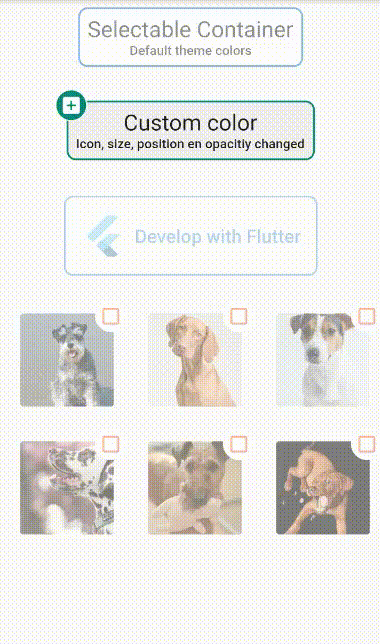

# selectable_container

A Selectable Container for Flutter. Easy to implement and customize.

## Demo


## Usage
To use plugin, just import package `import 'package:selectable_container/selectable_container.dart';`

## Example
Check de example directory to access the project that implements the image shown above.

````dart
    import 'package:flutter/material.dart';
    import 'package:selectable_container/selectable_container.dart';

    class SimpleExamplePage extends StatefulWidget {
      @override
      _SimpleExamplePageState createState() => _SimpleExamplePageState();
    }

    class _SimpleExamplePageState extends State<SimpleExamplePage> {
      @override
      Widget build(BuildContext context) {
        return Scaffold(
          appBar: AppBar(
            title: Text('Selectable Container'),
          ),
          body: Column(
            children: <Widget>[
              Text(
                'Default container',
                style: TextStyle(fontSize: 22, fontWeight: FontWeight.bold),
              ),
              SelectableContainer(
                onPressed: () {},
                child: Text('Tap me'),
                padding: 16.0,
              ),
            ],
          ),
        );
      }
    }
````
